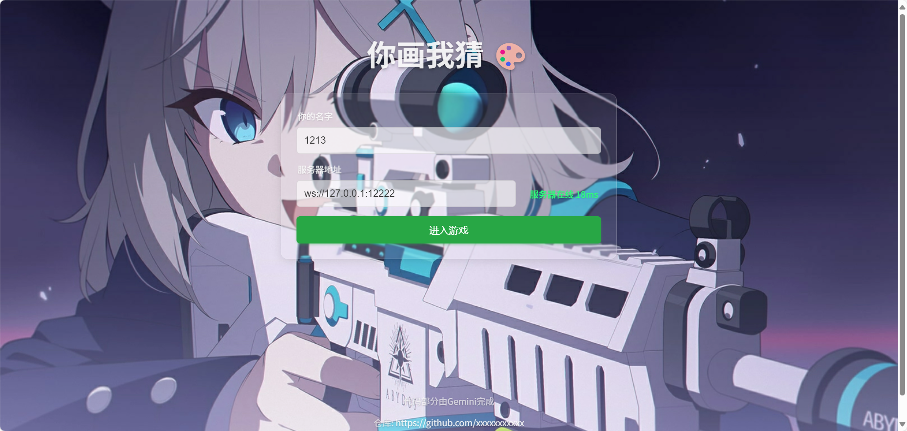
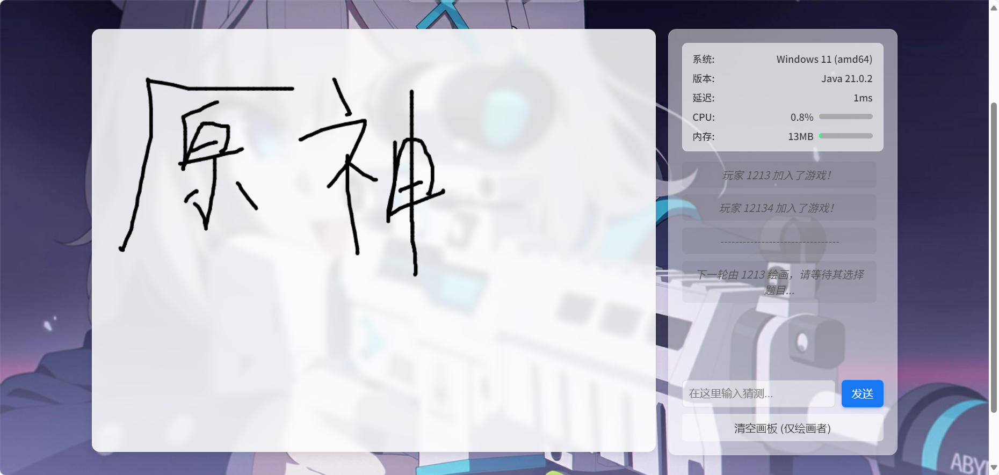

# You Draw, I Guess - Web Version

A "You Draw, I Guess" web game generated entirely by AI.

**~~This README was also primarily generated by Gemini.~~**

***[[Chinese-README]](https://github.com/llll415/You-Draw-I-Guess)***

## Project Screenshots





## 🛠️ Tech Stack

*   **Frontend**:
    *   **HTML5**: For building the page structure.
    *   **CSS3**: For page styling and aesthetics, including Flexbox layout, animations, and responsive design.
    *   **JavaScript (ES6+)**: Handles all client-side logic, including DOM manipulation, WebSocket communication, Canvas drawing, and user interaction.

*   **Backend**:
    *   **Java**: As the server-side development language.
    *   **Java-WebSocket**: A lightweight and efficient WebSocket server library for handling client connections and message forwarding.
    *   **SLF4J & Logback**: Used for logging server operations, facilitating debugging and monitoring.
    *   **Built-in HTTP Server**: Uses Java's built-in `com.sun.net.httpserver` to serve static frontend files, eliminating the need for additional configurations like Nginx.

*   **Core Protocol**:
    *   **WebSocket**: For full-duplex real-time communication between the client and server.

## 🚀 Quick Start

1.  **Prerequisites**:
    *   Ensure you have Java Development Kit (JDK) 8 or higher installed.
    *   Go to the **Releases** page and download `draw-guess-x.x.x-xxxx.jar`.
    *   After downloading, place it in a suitable location (e.g., a new folder) and run it using the following command:
        ```
        java -jar draw-guess-x.x.x-xxxx.jar
        ```
    *   Logs will be output to `logs/server.log`.
    *   The first time you run the server, it will generate a `server.properties` file, where you can configure the listening address/port for the HTTP and game servers.

### Compile from Source (using Maven)
1.  **Steps**:
    *   Download the source code package or clone the project.
    *   Navigate to the project directory (the one containing the `pom.xml` file).
    *   Open a terminal and run:
        ```
        mvn clean package
        ```
    *   After a successful build, you will find the `draw-guess-x.x.x-xxxx.jar` file in the `target` directory.
    *   Afterward, place this file in a folder and run it with the command below. Logs will be output to `logs/server.log`.
    *   The first time you run the server, it will generate a `server.properties` file where you can configure the addresses/ports for the HTTP and game servers.
        ```
        java -jar draw-guess-x.x.x-xxxx.jar
        ```

### Running the Client (Browser)

1.  **Start the Server**: Ensure you have successfully started the Java server.

2.  **Access the Game**:
    *   Open your modern browser (Chrome, Firefox, Edge recommended).
    *   Enter `http://<your_server_ip_address>:56678` in the address bar.
    *   If you are running the server locally, you can access it directly at `http://localhost:56678`.

3.  **Start Playing**:
    *   **Prerequisite: Having friends who want to play with you.**
    *   Set a nickname in the "Your Name" input field.
    *   The "Server Address" will default to `ws://localhost:12222`. If your server is deployed on another machine, please change it to the corresponding `ws://<server_ip>:<websocket_port>`.
    *   The connection status of the server (Online/Offline/Testing) will be displayed to the right of the server address.
    *   Click the "Enter Game" button.
    *   As the first player to join, you will become the host. When there are at least 2 players online, a "Start Game" button will appear for the host. Click it to begin the game.

## 🎮 Game Flow

1.  **Connect**: Players set a nickname and server address to connect to the game server.
2.  **Wait**: All players enter the waiting area. The system displays the current number of online players. When there are at least 2 players, the host can click "Start Game".
3.  **Choose a Word**: After the game starts, the system randomly selects a player as the "drawer" and privately sends them 3 word options.
4.  **Draw**: The drawer chooses a word and begins to draw it on the canvas. Their drawing is synchronized in real-time to all other players.
5.  **Guess**: Other players (the "guessers") watch the drawing and type their guesses in the chatbox.
6.  **Correct Guess**:
    *   When a player guesses the correct answer, the system announces it in the chat area, showing the successful guesser and the correct word.
    *   The current round ends.
7.  **Next Round**: The system clears the canvas and automatically selects the next player to be the new drawer, repeating steps 3-6.
8.  **Disconnect**: If a player leaves or disconnects, the system notifies all other players. If the drawer disconnects, the round ends immediately, and a new round begins.

## 📦 Project File Description

*   `src/main/resources/web/index.html`: The main HTML file of the game, defining the structure of all UI elements.
*   `src/main/resources/web/app.js`: The core JavaScript file of the game, handling all frontend logic.
*   `src/main/java/com/draw/server/WebSocketGameServer.java`: The complete Java code for the backend WebSocket server.
*   `src/main/resources/logback.xml`: The server's logging configuration file.
*   `src/main/java/com/draw/server/ServerConfig.java`: The server configuration file.

## 💡 Notes

*   **Background Image API**: The default API is `https://imageapi.hoshino2.top`. It's recommended to replace this, as it's self-hosted on a home cloud server.
