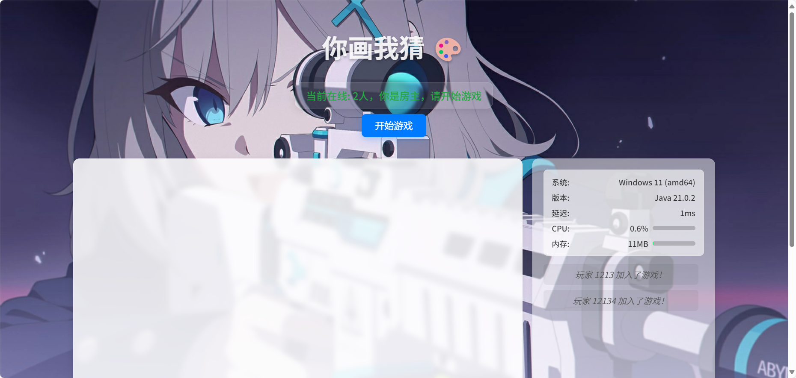

# Draw & Guess - Web Version

A completely AI-generated web game called "Draw Me, Guess"

**~~This README was also mainly generated by Gemini.~~**

## Project Screenshots





## 🛠️ Tech Stack

*   **Frontend**:
    *   **HTML5**: To build the page structure.
    *   **CSS3**: For page styling and aesthetics, including Flexbox layouts, animations, and responsive design.
    *   **JavaScript (ES6+)**: Handles all client-side logic, including DOM manipulation, WebSocket communication, Canvas drawing, and user interaction.

*   **Backend**:
    *   **Java**: As the server-side development language.
    *   **Java-WebSocket**: A lightweight and efficient WebSocket server library for handling client connections and message forwarding.
    *   **SLF4J & Logback**: For logging server operations, facilitating debugging and monitoring.
    *   **Built-in HTTP Server**: Uses Java's native `com.sun.net.httpserver` to serve frontend static files, eliminating the need for additional configurations like Nginx.

*   **Core Protocol**:
    *   **WebSocket**: For full-duplex real-time communication between the client and the server.

## 🚀 Quick Start

1.  **Requirements**:
    *   Ensure you have Java Development Kit (JDK) 8 or higher installed.
    *   Go to Releases and download `draw-guess-server-1.3.0-color.jar`.
    *   Place the downloaded file in a suitable location (create a new folder for it) and run it using the following command:
        ```
        java -jar draw-guess-server-1.3.0-color.jar
        ```
    *   Logs will be output to `logs/server.log`.

### Compile Yourself (using Maven)
1.  **Steps**:
    *   Download the source code package / Clone the project.
    *   Navigate to the project's root directory (the one containing the `pom.xml` file).
    *   Open a terminal and run:
        ```
        mvn clean package
        ```
    *   After a successful build, you will find the `draw-guess-server-1.3.0-color.jar` file in the `target` directory.
    *   Afterward, place this file into a new folder and run the command below to start. Logs will be output to `logs/server.log`.
        ```        java -jar draw-guess-server-1.3.0-color.jar
        ```

### Running the Client (Browser)

1.  **Start the Server**: Make sure you have successfully started the Java server.

2.  **Access the Game**:
    *   Open a modern browser (Chrome, Firefox, Edge are recommended).
    *   Enter `http://<Your_Server_IP>:56678` in the address bar.
    *   If you are running the server locally, you can directly access `http://localhost:56678`.

3.  **Start Playing**:
    *   **Prerequisite: Friends who are willing to play with you.**
    *   Set a nickname in the "Your Name" input field.
    *   The "Server Address" will default to `ws://localhost:12222`. If your server is deployed on another machine, please change it to the corresponding `ws://<Server_IP>:<WebSocket_Port>`.
    *   The connection status of the server will be displayed to the right of the server address (Online/Offline/Testing).
    *   Click the "Enter Game" button.
    *   As the first player to join, you will become the host. When there are at least 2 players online, a "Start Game" button will appear for the host. Click it to begin the game.

## 🎮 Game Flow

1.  **Connect**: Players set their nicknames and the server address to connect to the game server.
2.  **Wait**: All players enter the waiting area, where the system displays the current number of online players. When there are 2 or more players, the host can click "Start Game".
3.  **Choose a Word**: After the game starts, the system randomly selects a player as the "drawer" and privately sends them 3-word options.
4.  **Draw**: The drawer chooses a word and starts drawing on the canvas. Their drawing is synced in real-time to all other players.
5.  **Guess**: Other players (the guessers) type their answers in the chatbox based on the drawing.
6.  **Correct Guess**:
    *   When a player guesses the answer correctly, the system announces it in the chat, showing the successful guesser and the correct answer.
    *   The round ends.
7.  **Next Round**: The system clears the canvas and automatically selects the next player to be the new drawer, repeating steps 3-6.
8.  **Disconnect**: If a player leaves or disconnects, the system notifies all players. If the drawer disconnects, the round ends immediately, and a new one begins.

## 📦 Project File Descriptions

*   `src/main/resources/web/index.html`: The main HTML file for the game, defining the structure of all UI elements.
*   `src/main/resources/web/app.js`: The core JavaScript file for the game, handling all frontend logic.
*   `src/main/java/com/draw/server/WebSocketGameServer.java`: The complete Java code for the backend WebSocket server.
*   `src/main/resources/logback.xml`: The logging configuration file for the server.

## 💡 Important Notes

*   **Background Image API**: The default API used is `https://imageapi.hoshino2.top`. It's probably best to replace it, as it's hosted on my home cloud server.
