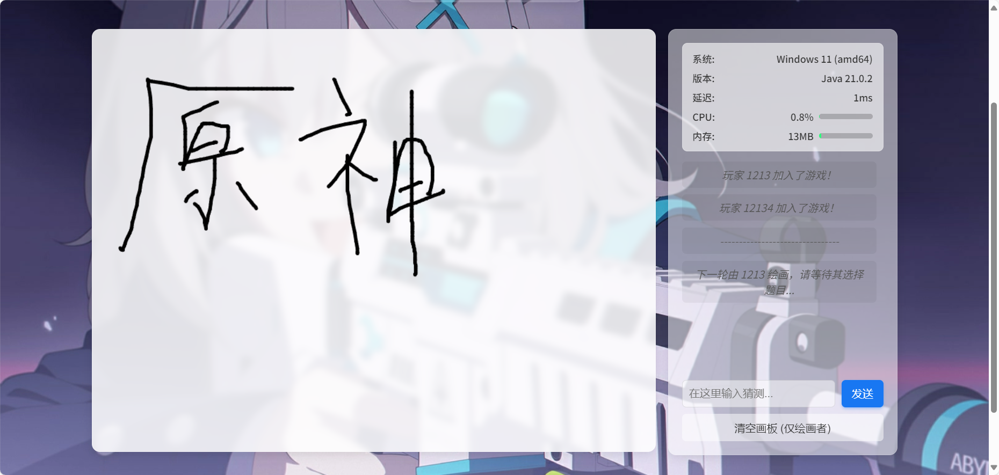

# 你画我猜 - Web版

这是一款经典的在线多人你画我猜游戏，完全基于Web技术实现。一位玩家根据得到的词语进行绘画，其他玩家实时竞猜，猜对获得分数，轮流进行，充满趣味和挑战，

**~~该readme主要也是由Gemini生成~~。**
## 项目截图




## 🛠️ 技术栈

*   **前端**:
    *   **HTML5**: 构建页面结构。
    *   **CSS3**: 负责页面样式和美观，包含Flexbox布局、动画和响应式设计。
    *   **JavaScript (ES6+)**: 处理所有客户端逻辑，包括DOM操作、WebSocket通信、Canvas绘图以及与用户的交互。

*   **后端**:
    *   **Java**: 作为服务端开发语言。
    *   **Java-WebSocket**: 一个轻量、高效的WebSocket服务端库，用于处理客户端连接和消息转发。
    *   **SLF4J & Logback**: 用于记录服务器运行日志，方便调试和监控。
    *   **内置HTTP服务器**: 使用Java内置的`com.sun.net.httpserver`提供前端静态文件服务，无需额外配置Nginx等。

*   **核心协议**:
    *   **WebSocket**: 用于客户端与服务器之间的全双工实时通信。

## 🚀 快速开始

1.  **环境要求**:
    *   确保已安装 Java Development Kit (JDK) 8 或更高版本。
    *   前往Releases下载`draw-guess-server-1.3.0-color.jar`
    *   下载好后放到一个合适的地方(新建一个文件夹装)然后使用以下命令运行
        ```
        java -jar draw-guess-server-1.3.0-color.jar
        ```
    *   日志将输出至logs\server.log中
### 自行编译(使用Maven)
1.  **步骤**:
    *   下载源码包/克隆项目
    *   进入项目目录内(有`pom.xml`文件的目录)
    *   打开终端运行
        ```
        mvn clean package
        ```
    *   构建成功后 即可在`target`目录下找到`draw-guess-server-1.3.0-color.jar`文件
    *   后续把该文件放进一个文件夹内使用命令以下运行即可使用 日志将输出至logs\server.log中
        ```
        java -jar draw-guess-server-1.3.0-color.jar
        ```

### 运行客户端 (浏览器)

1.  **启动服务端**: 确保你已经成功启动了Java服务端。

2.  **访问游戏**:
    *   打开你的现代浏览器 (推荐 Chrome, Firefox, Edge)。
    *   在地址栏输入 `http://<你的服务器IP地址>:56678`。
    *   如果你在本地运行服务器，可以直接访问 `http://localhost:56678`。

3.  **开始游戏**:
    *   **前提条件:有愿意和你玩的朋友**
    *   在 "你的名字" 输入框中设置一个昵称。
    *   "服务器地址" 默认会填写为 `ws://localhost:12222`。如果你的服务器部署在其他机器上，请修改为对应的 `ws://<服务器IP>:<WebSocket端口>`。
    *   服务器地址右侧会显示服务器的连接状态（在线/离线/测试中）。
    *   点击 "进入游戏" 按钮。
    *   作为第一个进入的玩家，你将成为房主。当有至少2名玩家在线时，房主界面会出现 "开始游戏" 按钮，点击即可启动游戏。

## 🎮 游戏流程

1.  **连接**: 玩家设置昵称和服务器地址，连接到游戏服务器。
2.  **等待**: 所有玩家进入等待区，系统会显示当前在线人数。当人数不少于2人时，房主可以点击 "开始游戏"。
3.  **选词**: 游戏开始后，系统会随机选择一位玩家作为 "绘画者"，并向其私密地发送3个词语选项。
4.  **绘画**: 绘画者选择一个词语后，在画板上进行绘画。其绘画轨迹会实时同步给所有其他玩家。
5.  **竞猜**: 其他玩家（竞猜者）根据画作在聊天框内输入猜测的答案。
6.  **猜对**:
    *   当有玩家猜对答案时，系统会在聊天区公布，并显示猜对的玩家和正确答案。
    *   本轮结束。
7.  **下一轮**: 系统会清空画板，并自动选择下一位玩家成为新的绘画者，重复步骤3-6。
8.  **断线**: 玩家离开或断线，系统会通知所有玩家。如果离开的是绘画者，则该轮立即结束并开始新一轮。

## 📦 项目文件说明

*   `src\main\resources\web\index.html`: 游戏的主HTML文件，定义了所有UI元素的结构。
*   `src\main\resources\web\app.js`: 游戏的核心JavaScript文件，处理所有前端逻辑。
*   `src\main\java\com\draw\server\WebSocketGameServer.java`: 后端WebSocket服务器的完整Java代码。
*   `src\main\resources\logback.xml`: 服务端的日志配置文件。

## 💡注意事项

*   **背景图片API**: 默认使用`https://imageapi.hoshino2.top`最好是换掉吧，家里云开的。

---